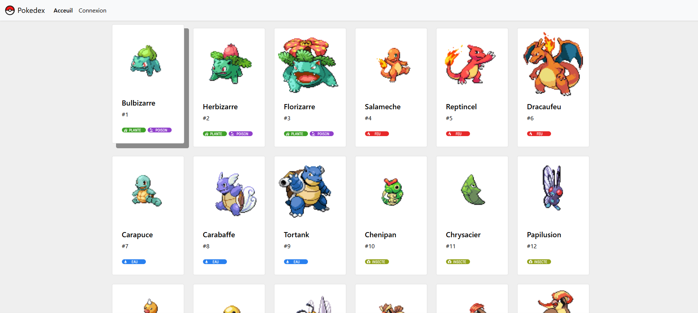

# Pokédex-S4

Site Pokédex affichant des informations détaillées sur les Pokémon.

## Description

Ce projet est un Pokédex développé dans le cadre du module BDD et IHM au semestre 4. Il permet d'afficher des informations détaillées sur divers Pokémon, y compris leurs types, statistiques, et descriptions.

## Fonctionnalités

- Affichage des informations détaillées sur chaque Pokémon
- Recherche de Pokémon par nom ou numéro
- Filtrage des Pokémon par type

## Technologies Utilisées

- PHP
- SQL
- HTML
- CSS
